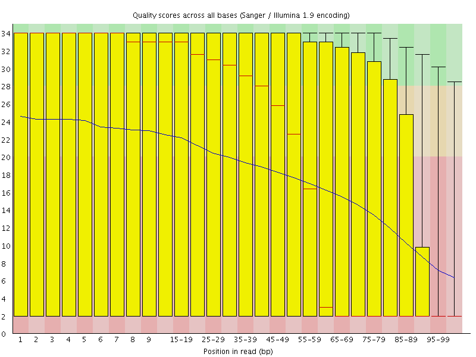
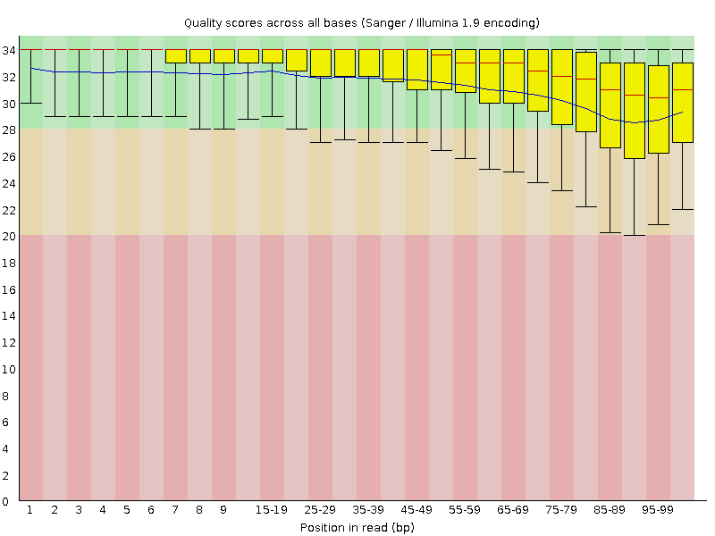
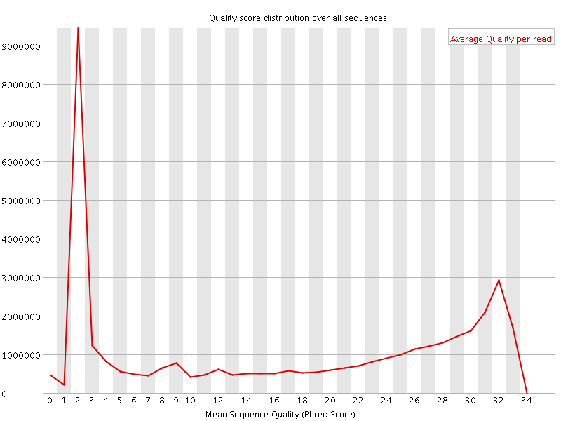
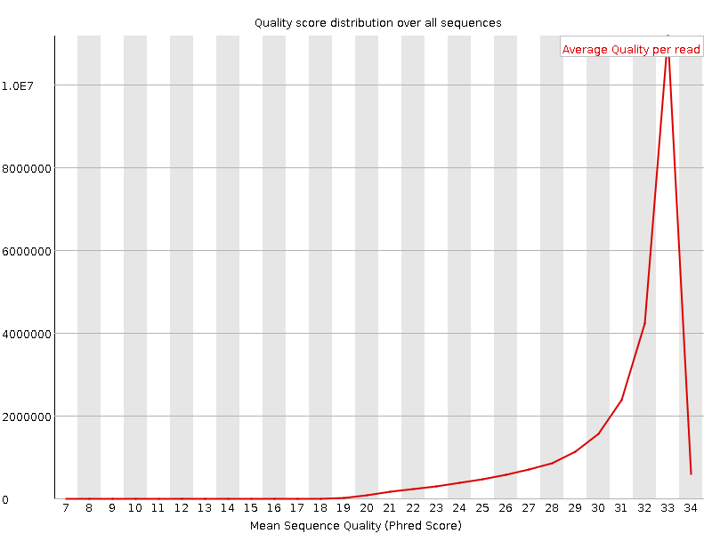
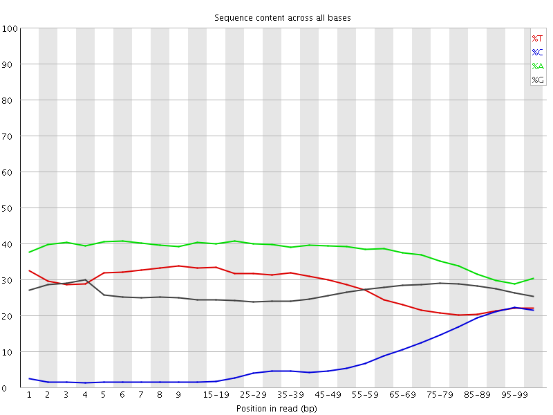
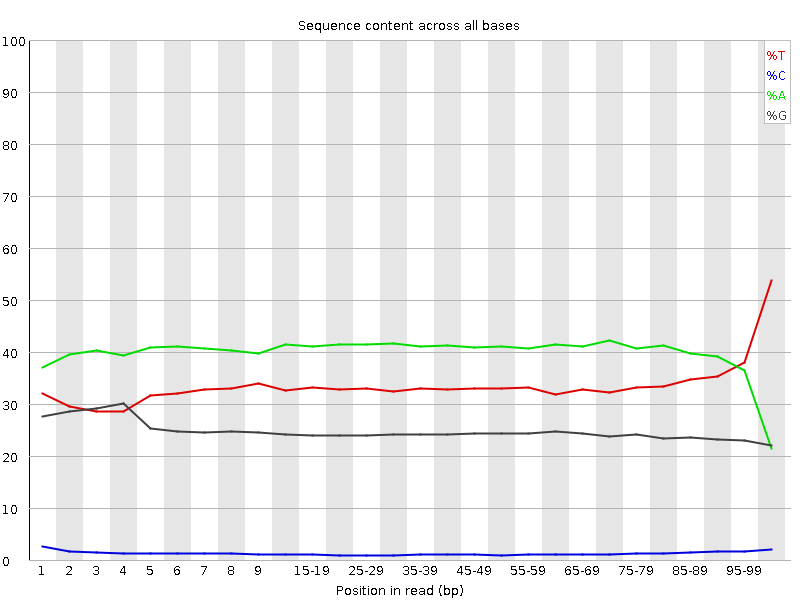

# Taking appropriate QC measures for RRBS-type or other -Seq applications with Trim Galore!

[](http://www.bioinformatics.babraham.ac.uk/index.html)


Last update: 02/07/2019

#### Table of Contents
* [Introduction](#version-063)
* [Methodology](#adaptive-quality-and-adapter-trimming-with-trim-galore)
  1. [Quality Trimming](#step-1-quality-trimming)
  2. [Adapter Trimming](#step-2-adapter-trimming)
    - [Auto-detection](#adapter-auto-detection)
    - [Manual adapter sequence specification](#manual-adapter-sequence-specification)
  3. [Removing Short Sequences](#step-3-removing-short-sequences)
  4. [Specialised Trimming - hard- and Epigenetic Clock Trimming](#step-4-specialised-trimming)
* [Full list of options for Trim Galore!](#full-list-of-options-for-trim-galore)
  * [RRBS-specific options](#rrbs-specific-options-mspi-digested-material)
  * [Paired-end specific options](#paired-end-specific-options)

## Version 0.6.3 dev

For all high throughput sequencing applications, we would recommend performing some quality control on the data, as it can often straight away point you towards the next steps that need to be taken (e.g. with [FastQC](http://www.bioinformatics.babraham.ac.uk/projects/fastqc/)). Thorough quality control and taking appropriate steps to remove problems is vital for the analysis of almost all sequencing applications. This is even more critical for the proper analysis of RRBS libraries since they are susceptible to a variety of errors or biases that one could probably get away with in other sequencing applications. In our [brief guide to RRBS](http://www.bioinformatics.babraham.ac.uk/projects/bismark/RRBS_Guide.pdf) we discuss the following points:

* poor qualities – affect mapping, may lead to incorrect methylation calls and/or mis-mapping
* adapter contamination – may lead to low mapping efficiencies, or, if mapped, may result in incorrect methylation calls and/or mis-mapping
* positions filled in during end-repair will infer the methylation state of the cytosine used for the fill-in reaction but not of the true genomic cytosine
* paired-end RRBS libraries (especially with long read length) yield redundant methylation information if the read pairs overlap
* RRBS libraries with long read lengths suffer more from all of the above due to the short size- selected fragment size


Poor base call qualities or adapter contamination are however just as relevant for 'normal', i.e. non-RRBS, libraries.


## Adaptive quality and adapter trimming with Trim Galore

We have tried to implement a method to rid RRBS libraries (or other kinds of sequencing datasets) of potential problems in one convenient process. For this we have developed a wrapper script (trim_galore) that makes use of the publicly available adapter trimming tool [Cutadapt](https://cutadapt.readthedocs.io/en/stable/) and [FastQC](http://www.bioinformatics.babraham.ac.uk/projects/fastqc/) for optional quality control once the trimming process has completed.

Even though Trim Galore works for any (base space) high throughput dataset (e.g. downloaded from the SRA) this section describes its use mainly with respect to RRBS libraries.

### Step 1: Quality Trimming
In the first step, low-quality base calls are trimmed off from the 3' end of the reads before adapter removal. This efficiently removes poor quality portions of the reads.


|    |   |
|:--------:|:---:|
| **Before Quality Trimming** | **After Quality Trimming** |
|    |   |

> Here is an example of a dataset downloaded from the SRA which was trimmed with a Phred score threshold of 20 (data set DRR001650_1 from Kobayashi et al., 2012).

### Step 2: Adapter Trimming
In the next step, Cutadapt finds and removes adapter sequences from the 3’ end of reads. 

#### Adapter auto-detection
If no sequence was supplied, Trim Galore will attempt to auto-detect the adapter which has been used. For this it will analyse the first 1 million sequences of the first specified file and attempt to find the first 12 or 13bp of the following standard adapters:

```
Illumina:   AGATCGGAAGAGC
Small RNA:  TGGAATTCTCGG
Nextera:    CTGTCTCTTATA
```

If no adapter contamination can be detected within the first 1 million sequences, or in case of a tie between several different adapters, Trim Galore defaults to `--illumina`, as long as the Illumina adapter sequence was one of the options. If there was a tie between the Nextera and small RNA adapter, the default is `--nextera`. The auto-detection results are shown on screen and printed to the trimming report for future reference.

#### Manual adapter sequence specification
The auto-detection behaviour can be overruled by specifying an adapter sequence manually or by using `--illumina`, `--nextera` or `--small_rna`. **Please note**: the first 13 bp of the standard Illumina paired-end adapters (`AGATCGGAAGAGC`) recognise and removes adapter from most standard libraries, including the Illumina TruSeq and Sanger iTag adapters. This sequence is present on both sides of paired-end sequences, and is present in all adapters before the unique Index sequence occurs. So for any 'normal' kind of sequencing you do not need to specify anything but `--illumina`, or better yet just use the auto-detection. 

To control the stringency of the adapter removal process one gets to specify the minimum number of required overlap with the adapter sequence; else it will default to 1. This default setting is extremely stringent, i.e. an overlap with the adapter sequence of even a single bp is spotted and removed. This may appear unnecessarily harsh; however, as a reminder adapter contamination may in a Bisulfite-Seq setting lead to mis-alignments and hence incorrect methylation calls, or result in the removal of the sequence as a whole because of too many mismatches in the alignment process.

Tolerating adapter contamination is most likely detrimental to the results, but we realize that this process may in some cases also remove some genuine genomic sequence. It is unlikely that the removed bits of sequence would have been involved in methylation calling anyway (since only the 4th and 5th adapter base would possibly be involved in methylation calls, for directional libraries). However, it is quite likely that true adapter contamination – irrespective of its length – would be detrimental for the alignment or methylation call process, or both.

| **Before Adapter Trimming** | **After Adapter Trimming** |
|:--------:|:---:|
|    |   |


> This example (same dataset as above) shows the dramatic effect of adapter contamination on the base composition of the analysed library, e.g. the C content rises from ~1% at the start of reads to around 22% (!) towards the end of reads. Adapter trimming with Cutadapt gets rid of most signs of adapter contamination efficiently. Note that the sharp decrease of A at the last position is a result of removing the adapter sequence very stringently, i.e. even a single trailing A at the end is removed.


#### RRBS Mode
Trim galore! also has an `--rrbs` option for DNA material that was digested with the restriction enzyme MspI. In this mode, Trim Galore identifies sequences that were adapter-trimmed and removes another 2 bp from the 3' end of Read 1, and for paired-end libraries also the first 2 bp of Read 2 (which is equally affected by the fill-in procedure). This is to avoid that the filled-in cytosine position close to the second MspI site in a sequence is used for methylation calls. Sequences which were merely trimmed because of poor quality will not be shortened any further.

#### Non-directional mode
Trim Galore! also has a `--non_directional` option, which will screen adapter-trimmed sequences for the presence of either CAA or CGA at the start of sequences and clip off the first 2 bases if found. If CAA or CGA are found at the start, no bases will be trimmed off from the 3’ end even if the sequence had some contaminating adapter sequence removed (in this case the sequence read likely originated from either the CTOT or CTOB strand).

### Step 3: Removing Short Sequences
Lastly, since quality and/or adapter trimming may result in very short sequences (sometimes as short as 0 bp), Trim Galore! can filter trimmed reads based on their sequence length (default: 20 bp). This is to reduce the size of the output file and to avoid crashes of alignment programs which require sequences with a certain minimum length.

#### Paired-End Data
Note that it is not recommended to remove too-short sequences if the analysed FastQ file is one of a pair of paired-end files, since this confuses the sequence-by-sequence order of paired-end reads which is again required by many aligners. For paired-end files, Trim Galore! has an option `--paired` which runs a paired-end validation on both trimmed `_1` and `_2` FastQ files once the trimming has completed. This step removes entire read pairs if at least one of the two sequences became shorter than a certain threshold. If only one of the two reads is longer than the set threshold, e.g. when one read has very poor qualities throughout, this singleton read can be written out to unpaired files (see option `retain_unpaired`) which may be aligned in a single-end manner.


Applying these steps to both self-generated and downloaded data can ensure that you really only use the high quality portion of the data for alignments and further downstream analyses and conclusions.

### Step 4: Specialised Trimming

#### Hard-trimming to leave bases at the 5'-end
The option `--hardtrim5 INT` allows you to hard-clip sequences from their 3' end. This option processes one or more files (plain FastQ or gzip compressed files) and produces hard-trimmed FastQ files ending in `.{INT}bp_5prime.fq(.gz)`. This is useful when you want to shorten reads to a certain read length. Here is an example:

```
before:         CCTAAGGAAACAAGTACACTCCACACATGCATAAAGGAAATCAAATGTTATTTTTAAGAAAATGGAAAAT
--hardtrim5 20: CCTAAGGAAACAAGTACACT
```

#### Hard-trimming to leave bases at the 3'-end
The option `--hardtrim3 INT` allows you to hard-clip sequences from their 5' end. This option processes one or more files (plain FastQ or gzip compressed files) and produces hard-trimmed FastQ files ending in `.{INT}bp_3prime.fq(.gz)`. We found this quite useful in a number of scenarios where we wanted to removed biased residues from the start of sequences. Here is an example :

```
before:         CCTAAGGAAACAAGTACACTCCACACATGCATAAAGGAAATCAAATGTTATTTTTAAGAAAATGGAAAAT
--hardtrim3 20:                                                   TTTTTAAGAAAATGGAAAAT
```


#### Mouse Epigenetic Clock trimming
The option `--clock` trims reads in a specific way that is currently used for the Mouse Epigenetic Clock (see here: [Multi-tissue DNA methylation age predictor in mouse, Stubbs et al., Genome Biology, 2017 18:68](https://genomebiology.biomedcentral.com/articles/10.1186/s13059-017-1203-5)). Following the trimming, Trim Galore exits.

In it's current implementation, the dual-UMI RRBS reads come in the following format:

```
Read 1  5' UUUUUUUU CAGTA FFFFFFFFFFFFFFFFFFFFFFFFFFFFFFFFFFFF TACTG UUUUUUUU 3'
Read 2  3' UUUUUUUU GTCAT FFFFFFFFFFFFFFFFFFFFFFFFFFFFFFFFFFFF ATGAC UUUUUUUU 5'
```

Where UUUUUUUU is a random 8-mer unique molecular identifier (UMI), CAGTA is a constant region,
and FFFFFFF... is the actual RRBS-Fragment to be sequenced. The UMIs for Read 1 (R1) and
Read 2 (R2), as well as the fixed sequences (F1 or F2), are written into the read ID and
removed from the actual sequence. Here is an example:

```
R1: @HWI-D00436:407:CCAETANXX:1:1101:4105:1905 1:N:0: CGATGTTT
    ATCTAGTTCAGTACGGTGTTTTCGAATTAGAAAAATATGTATAGAGGAAATAGATATAAAGGCGTATTCGTTATTG
R2: @HWI-D00436:407:CCAETANXX:1:1101:4105:1905 3:N:0: CGATGTTT
    CAATTTTGCAGTACAAAAATAATACCTCCTCTATTTATCCAAAATCACAAAAAACCACCCACTTAACTTTCCCTAA

R1: @HWI-D00436:407:CCAETANXX:1:1101:4105:1905 1:N:0: CGATGTTT:R1:ATCTAGTT:R2:CAATTTTG:F1:CAGT:F2:CAGT
                 CGGTGTTTTCGAATTAGAAAAATATGTATAGAGGAAATAGATATAAAGGCGTATTCGTTATTG
R2: @HWI-D00436:407:CCAETANXX:1:1101:4105:1905 3:N:0: CGATGTTT:R1:ATCTAGTT:R2:CAATTTTG:F1:CAGT:F2:CAGT
                 CAAAAATAATACCTCCTCTATTTATCCAAAATCACAAAAAACCACCCACTTAACTTTCCCTAA
```
Following clock trimming, the resulting files (.clock_UMI.R1.fq(.gz) and .clock_UMI.R2.fq(.gz))
should be adapter- and quality trimmed with a second Trim Galore run. Even though the data is technically RRBS, it doesn't require the `--rrbs` option. Instead the reads need to be trimmed by 15bp from their 3' end to get rid of potential UMI and fixed sequences. All this is accomplished with this additional trimming command:

`trim_galore --paired --three_prime_clip_R1 15 --three_prime_clip_R2 15 *.clock_UMI.R1.fq.gz *.clock_UMI.R2.fq.gz`

Following this, reads should be aligned with Bismark and deduplicated with UmiBam in `--dual_index` mode (see here: https://github.com/FelixKrueger/Umi-Grinder). UmiBam recognises the UMIs within this pattern: R1:(**ATCTAGTT**):R2:(**CAATTTTG**): as (UMI R1=**ATCTAGTT**) and (UMI R2=**CAATTTTG**).


## Full list of options for Trim galore!

**USAGE:** `trim_galore [options] <filename(s)>`

### General options:

* `-h/--help`
  * Print this help message and exits.
  
* `-v/--version`
  * Print the version information and exits.
  
* `-q/--quality <INT>`
  * Trim low-quality ends from reads in addition to adapter removal. For RRBS samples, quality trimming will be performed first, and adapter trimming is carried in a second round. Other files are quality and adapter trimmed in a single pass. The algorithm is the same as the one used by BWA (Subtract INT from all qualities; compute partial sums from all indices to the end of the sequence; cut sequence at the index at which the sum is minimal).
  * Default Phred score: `20`
  
* `--phred33`
  * Instructs Cutadapt to use `ASCII+33` quality scores as Phred scores (Sanger/Illumina 1.9+ encoding) for quality trimming.
  * Default: `ON`
  
* `--phred64`
  * Instructs Cutadapt to use `ASCII+64` quality scores as Phred scores (Illumina 1.5 encoding) for quality trimming.
  
* `--fastqc`
  * Run FastQC in the default mode on the FastQ file once trimming is complete.
  
* `--fastqc_args "<ARGS>"`
  * Passes extra arguments to FastQC. If more than one argument is to be passed to FastQC they must be in the form `arg1 arg2 [..]`.
  * An example would be: `--fastqc_args "--nogroup --outdir /home/"`.
  * Passing extra arguments will automatically invoke FastQC, so `--fastqc` does not have to be specified separately.

* `-a/--adapter <STRING>`
  * Adapter sequence to be trimmed. If not specified explicitly, Trim Galore will try to auto-detect whether the Illumina universal, Nextera transposase or Illumina small RNA adapter sequence was used. Also see `--illumina`, `--nextera` and `--small_rna`.
  * If no adapter can be detected within the first 1 million sequences of the first file specified Trim Galore defaults to `--illumina`. A single base may also be given as e.g. `-a A{10}`, to be expanded to `-a AAAAAAAAAA`.

* `-a2/--adapter2 <STRING>`
  * Optional adapter sequence to be trimmed off read 2 of paired-end files. This option requires `--paired` to be specified as well. If the libraries to be trimmed are smallRNA then a2 will be set to the Illumina small RNA 5' adapter automatically (`GATCGTCGGACT`). A single base may also be given as e.g. `-a2 A{10}`, to be expanded to `-a2 AAAAAAAAAA`.

* `--illumina`
  * Adapter sequence to be trimmed is the first 13bp of the Illumina universal adapter `AGATCGGAAGAGC` instead of the default auto-detection of adapter sequence.

* `--nextera`
  * Adapter sequence to be trimmed is the first 12bp of the Nextera adapter `CTGTCTCTTATA` instead of the default auto-detection of adapter sequence.

* `--small_rna`
  * Adapter sequence to be trimmed is the first 12bp of the _Illumina Small RNA 3' Adapter_ `TGGAATTCTCGG` instead of the default auto-detection of adapter sequence. 
  * Selecting to trim smallRNA adapters will also lower the `--length` value to 18bp. If the smallRNA libraries are paired-end then `-a2` will be set to the Illumina small RNA 5' adapter automatically (`GATCGTCGGACT`) unless `-a 2` had been defined explicitly.
* `--max_length <INT>`
  * Discard reads that are longer than <INT> bp after trimming. This is only advised for smallRNA sequencing to remove non-small RNA sequences.

* `-s/--stringency <INT>`
  * Overlap with adapter sequence required to trim a sequence.
  * Defaults to a very stringent setting of `1`, _i.e._ even a single base pair of overlapping sequence will be trimmed of the 3' end of any read.

* `-e <ERROR RATE>`
  * Maximum allowed error rate (no. of errors divided by the length of the matching region)
  * Default: `0.1`

* `--gzip`
  * Compress the output file with `gzip`.
  * If the input files are gzip-compressed the output files will be automatically gzip compressed as well.

* `--dont_gzip`
  * Output files won't be compressed with gzip. This overrides `--gzip`.
  
* `--length <INT>`
  * Discard reads that became shorter than length INT because of either quality or adapter trimming. A value of `0` effectively disables this behaviour.
  * Default: `20 bp`.
  * For paired-end files, both reads of a read-pair need to be longer than <INT> bp to be printed out to validated paired-end files (see option `--paired`). If only one read became too short there is the possibility of keeping such unpaired single-end reads (see `--retain_unpaired`).
  * Default pair-cutoff: `20 bp`.

* `--max_n COUNT`
  * The total number of `Ns` (as integer) a read may contain before it will be removed altogether.
  * In a paired-end setting, either read exceeding this limit will result in the entire pair being removed from the trimmed output files.

* `--trim-n`
  * Removes `Ns` from either side of the read.
  * This option does currently not work in RRBS mode.

* `-o/--output_dir <DIR>`
  * If specified all output will be written to this directory instead of the current directory. If the directory doesn't exist it will be created for you.

* `--no_report_file`
  * If specified no report file will be generated.

* `--suppress_warn`
  * If specified any output to `STDOUT` or `STDERR` will be suppressed.

* `--clip_R1 <int>`
  * Instructs Trim Galore to remove <int> bp from the 5' end of read 1 (or single-end reads). This may be useful if the qualities were very poor, or if there is some sort of unwanted bias at the 5' end.
  * Default: `OFF`

* `--clip_R2 <int>	`
  * Instructs Trim Galore to remove <int> bp from the 5' end of read 2 (paired-end reads only). This may be useful if the qualities were very poor, or if there is some sort of unwanted bias at the 5' end.
  * For paired-end BS-Seq, it is recommended to remove the first few bp because the end-repair reaction may introduce a bias towards low methylation. Please refer to the M-bias plot section in the Bismark User Guide for some examples.
  * Default: `OFF`

* `--three_prime_clip_R1 <int>`
  * Instructs Trim Galore to remove `<int>` bp from the 3' end of read 1 (or single-end reads) _AFTER_ adapter/quality trimming has been performed. This may remove some unwanted bias from the 3' end that is not directly related to adapter sequence or basecall quality.
  * Default: `OFF`

* `--three_prime_clip_R2 <int>`
  * Instructs Trim Galore to re move `<int>` bp from the 3' end of read 2 _AFTER_ adapter/quality trimming has been performed. This may remove some unwanted bias from the 3' end that is not directly related to adapter sequence or basecall quality.
  * Default: `OFF`
  
* `--2colour/--nextseq INT`
  * This enables the option `--nextseq-trim=3'CUTOFF` within Cutadapt, which will set a quality cutoff (that is normally given with -q instead), but qualities of G bases are ignored. This trimming is in common for the NextSeq- and NovaSeq-platforms, where basecalls without any signal are called as high-quality G bases. More on the issue of G-overcalling may be found here: https://sequencing.qcfail.com/articles/illumina-2-colour-chemistry-can-overcall-high-confidence-g-bases/. This is mutually exlusive with `-q INT`.

* `--path_to_cutadapt </path/to/cutadapt>`
  
  * You may use this option to specify a path to the Cutadapt executable, e.g. `/my/home/cutadapt-1.7.1/bin/cutadapt`. Else it is assumed that Cutadapt is in the `PATH`.

* `--basename <PREFERRED_NAME>`

  * Use PREFERRED_NAME as the basename for output files, instead of deriving the filenames from the input files. Single-end data would be called `PREFERRED_NAME_trimmed.fq(.gz)`, or `PREFERRED_NAME_val_1.fq(.gz)` and `PREFERRED_NAME_val_2.fq(.gz)` for paired-end data. `--basename` only works when 1 file (single-end) or 2 files (paired-end) are specified, but not for longer lists.

* `-j/--cores INT` 

  * Number of cores to be used for trimming [default: 1]. For Cutadapt to work with multiple cores, it requires Python 3 as well as parallel gzip (`pigz`) installed on the system. The version of Python used is detected from the shebang line of the Cutadapt executable (either `cutadapt`, or a specified path). If Python 2 is detected, `--cores` is set to `1`. If `pigz` cannot be detected on your system, Trim Galore reverts to using `gzip` compression. Please note that `gzip` compression will slow down multi-core processes so much that it is hardly worthwhile, please see: https://github.com/FelixKrueger/TrimGalore/issues/16#issuecomment-458557103 for more info).

  * Actual core usage: It should be mentioned that the actual number of cores used is a little convoluted. Assuming that Python 3 is used and pigz is installed, `--cores 2` would use 2 cores to read the input (probably not at a high usage though), 2 cores to write to the output (at moderately high usage), and 2 cores for Cutadapt itself + 2 additional cores for Cutadapt (not sure what they are used for) + 1 core for Trim Galore itself. So this can be up to 9 cores, even though most of them won't be used at 100% for most of the time. Paired-end processing uses twice as many cores for the validation (= writing out) step. `--cores 4` would then be: 4 (read) + 4 (write) + 4 (Cutadapt) + 2 (extra Cutadapt) +     1 (Trim Galore) = 15, and so forth.

  * It seems that `--cores 4` could be a sweet spot, anything above has diminishing returns.


### SPECIFIC TRIMMING - without adapter/quality trimming

* `--hardtrim5 <int>`
  * Instead of performing adapter-/quality trimming, this option will simply hard-trim sequences to <int> bp from the 3'-end. Once hard-trimming of files is complete, Trim Galore will exit. Hard-trimmed output files will end in `.<int>bp_5prime.fq(.gz)`.

* `--hardtrim3 <int>`
  * Instead of performing adapter-/quality trimming, this option will simply hard-trim sequences to <int> bp from the 5'-end. Once hard-trimming of files is complete, Trim Galore will exit. Hard-trimmed output files will end in `.<int>bp_3prime.fq(.gz)`.
  
* `--clock`
  * In this mode, reads are trimmed in a specific way that is currently used for the Mouse Epigenetic Clock (see here: Multi-tissue DNA methylation age predictor in mouse, Stubbs et al., Genome Biology, 2017 18:68 https://doi.org/10.1186/s13059-017-1203-5). Following this, Trim Galore will exit.

  In it's current implementation, the dual-UMI RRBS reads come in the following format:

  ```
  Read 1  5' UUUUUUUU CAGTA FFFFFFFFFFFFFFFFFFFFFFFFFFFFFFFFFFFF TACTG UUUUUUUU 3'
  Read 2  3' UUUUUUUU GTCAT FFFFFFFFFFFFFFFFFFFFFFFFFFFFFFFFFFFF ATGAC UUUUUUUU 5'
  ```
  
  Where UUUUUUUU is a random 8-mer unique molecular identifier (UMI), CAGTA is a constant region and FFFFFFF... is the actual RRBS-Fragment to be sequenced. The UMIs for Read 1 (R1) and Read 2 (R2), as well as the fixed sequences (F1 or F2), are written into the read ID and removed from the actual sequence. Here is an example:

  ```
  R1: @HWI-D00436:407:CCAETANXX:1:1101:4105:1905 1:N:0: CGATGTTT
      ATCTAGTTCAGTACGGTGTTTTCGAATTAGAAAAATATGTATAGAGGAAATAGATATAAAGGCGTATTCGTTATTG
  R2: @HWI-D00436:407:CCAETANXX:1:1101:4105:1905 3:N:0: CGATGTTT
      CAATTTTGCAGTACAAAAATAATACCTCCTCTATTTATCCAAAATCACAAAAAACCACCCACTTAACTTTCCCTAA

  R1: @HWI-D00436:407:CCAETANXX:1:1101:4105:1905 1:N:0: CGATGTTT:R1:ATCTAGTT:R2:CAATTTTG:F1:CAGT:F2:CAGT
                   CGGTGTTTTCGAATTAGAAAAATATGTATAGAGGAAATAGATATAAAGGCGTATTCGTTATTG
  R2: @HWI-D00436:407:CCAETANXX:1:1101:4105:1905 3:N:0: CGATGTTT:R1:ATCTAGTT:R2:CAATTTTG:F1:CAGT:F2:CAGT
                   CAAAAATAATACCTCCTCTATTTATCCAAAATCACAAAAAACCACCCACTTAACTTTCCCTAA
  ```
  
  Following clock trimming, the resulting files (.clock_UMI.R1.fq(.gz) and .clock_UMI.R2.fq(.gz)) should be adapter- and quality trimmed with Trim Galore as usual. In addition, reads need to be trimmed by 15bp from their 3' end to get rid of potential UMI and fixed sequences. The command is:

  ```
  trim_galore --paired --three_prime_clip_R1 15 --three_prime_clip_R2 15 *.clock_UMI.R1.fq.gz *.clock_UMI.R2.fq.gz
  ```
  Following this, reads should be aligned with Bismark and deduplicated with UmiBam in `--dual_index` mode (see here: https://github.com/FelixKrueger/Umi-Grinder). UmiBam recognises the UMIs within this pattern: R1:(**ATCTAGTT**):R2:(**CAATTTTG**): as (UMI R1=ATCTAGTT) and (UMI R2=CAATTTTG).


### RRBS-specific options (MspI digested material):
* `--rrbs`
  * Specifies that the input file was an MspI digested RRBS sample (recognition site: `CCGG`). Sequences which were adapter-trimmed will have a further 2 bp removed from their 3' end. This is to avoid that the filled-in C close to the second MspI site in a sequence is used for methylation calls. Sequences which were merely trimmed because of poor quality will not be shortened further.

* `--non_directional`
  * Selecting this option for non-directional RRBS libraries will screen quality-trimmed sequences for `CAA` or `CGA` at the start of the read and, if found, removes the first two base pairs. Like with the option `--rrbs` this avoids using cytosine positions that were filled-in during the end-repair step. `--non_directional` requires `--rrbs` to be specified as well.

* `--keep`
  * Keep the quality trimmed intermediate file. If not specified the temporary file will be deleted after adapter trimming. Only has an effect for RRBS samples since other FastQ files are not trimmed for poor qualities separately.
  * Default: `OFF`

##### Note for RRBS using MseI:
If your DNA material was digested with MseI (recognition motif: TTAA) instead of MspI it is _NOT_ necessary to specify `--rrbs` or `--non_directional` since virtually all reads should start with the sequence `TAA`, and this holds true for both directional and non-directional libraries. As the end-repair of `TAA` restricted sites does not involve any cytosines it does not need to be treated especially. Instead, simply run Trim Galore! in the standard, i.e. non-RRBS, mode.


### Paired-end specific options:
* `--paired`
  * This option performs length trimming of quality/adapter/RRBS trimmed reads for paired-end files. To pass the validation test, both sequences of a sequence pair are required to have a certain minimum length which is governed by the option `--length` (see above). If only one read passes this length threshold the other read can be rescued (see option `--retain_unpaired`).
  * Using this option lets you discard too short read pairs without disturbing the sequence-by-sequence order of FastQ files which is required by many aligners.
  Trim Galore! expects paired-end files to be supplied in a pairwise fashion, e.g. `file1_1.fq` `file1_2.fq` `SRR2_1.fq.gz` `SRR2_2.fq.gz` `...` .
* `-t/--trim1`
  * Trims 1 bp off every read from its 3' end.
  * This may be needed for FastQ files that are to be aligned as paired-end data with Bowtie 1. This is because Bowtie (1) regards alignments like this as invalid (whenever a start/end coordinate is contained within the other read):
```bash
R1 --------------------------->
R2 <---------------------------
# or this:
R1 ----------------------->
R2       <-----------------
```
* `--retain_unpaired`
  * If only one of the two paired-end reads became too short, the longer read will be written to either `.unpaired_1.fq` or `.unpaired_2.fq` output files. The length cutoff for unpaired single-end reads is governed by the parameters `-r1`/`--length_1` and `-r2`/`--length_2`.
  * Default: `OFF`.
* `-r1/--length_1 <INT>`
  * Unpaired single-end read length cutoff needed for read 1 to be written to `.unpaired_1.fq` output file. These reads may be mapped in single-end mode.
  * Default: `35 bp`
* `-r2/--length_2 <INT>`
  * Unpaired single-end read length cutoff needed for read 2 to be written to `.unpaired_2.fq` output file. These reads may be mapped in single-end mode.
  * Default: `35 bp`
  
